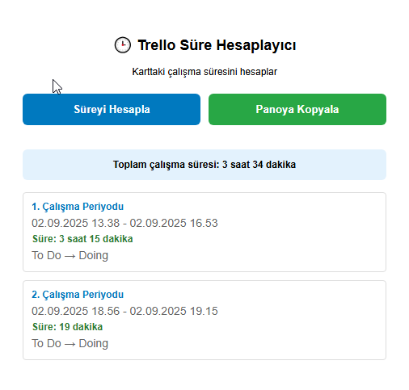

# 🕒 Trello Süre Hesaplayıcı / 🕒 Trello Time Tracker

Bu Chrome eklentisi, Trello kartlarındaki **çalışma sürelerini otomatik olarak hesaplar**.  
Kart hangi tarihlerde "Doing" listesine girip çıktığını analiz eder ve toplam süreyi gösterir.

This Chrome extension automatically calculates the **work time** on Trello cards.  
It analyzes when a card enters and exits the "Doing" list and shows the total duration.

## 🚀 Özellikler / 🚀 Features
- Trello kartındaki hareketleri tarar / Scans Trello card movements
- Çalışma periyotlarını hesaplar / Calculates work periods
- Toplam süreyi gösterir / Displays total duration
- Sonuçları Markdown formatında panoya kopyalayabilirsin / You can copy the results to your clipboard in Markdown format



## 📥 Kurulum / 📥 Installation

1. Bu repo’yu bilgisayarına klonla veya indir / Clone or download this repo to your computer:
   ```bash
   git clone https://github.com/hulusimsek/trello-sure-hesaplayici.git
   ```

2. Chrome’da chrome://extensions/ sayfasına git / Go to chrome://extensions/ in Chrome.

3. Sağ üstten Geliştirici Modunu aç / Enable Developer Mode at the top right.

4. Paketlenmemiş öğe yükle butonuna bas / Click on "Load unpacked".

5. İndirdiğin klasörü seç / Select the folder you downloaded.
